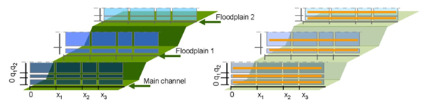
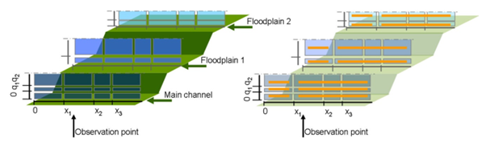
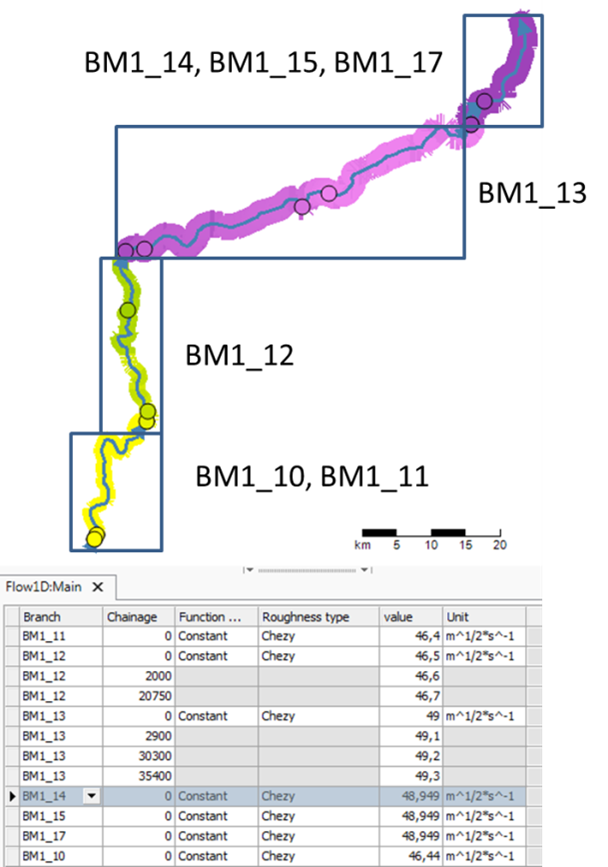
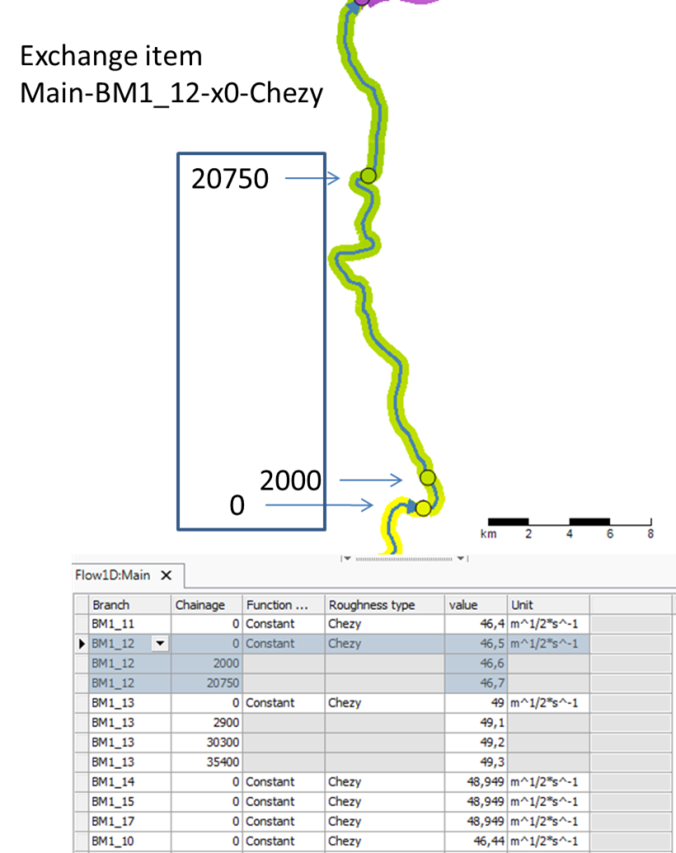
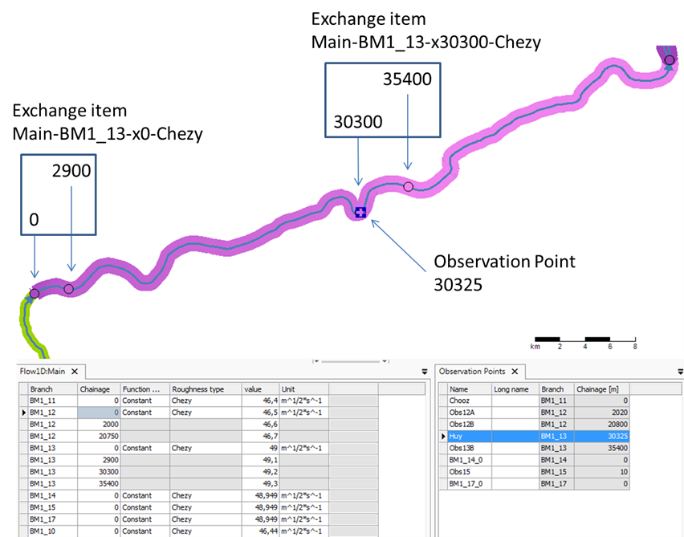

===========================================
Sobek3 D-Flow1D calibration twin experiment 
===========================================

This page describes a Sobek3 D-Flow1D calibration twin experiment with OpenDA.
More information about twin experiments can be found :ref:`here<twin>`.  In
this experiment the roughness values of a modelled part of the Belgian Meuse
are calibrated. This is done by splitting the river over multiple branches with
different roughness definitions. Those branches can have different roughness
values at different positions. These roughness values can be tweaked by OpenDA
for calibration with the use of exchange items. Below we first discuss how the
roughness values are divided over the exchange items. For validation of the
calibration steps water level values from a Sobek3 D-Flow1D model run are used
as observations. 

For the twin experiment we disturb the original roughness by adding 1.00. By
running OpenDA these roughness values will be changed step by step each time
comparing the resulting simulated water levels with the water levels from the
observations. This way the roughness values should revert back to the original
values from the model run that generated the water level observations which
proves the calibration is working correctly.

 
Exchange items for roughness values
-----------------------------------

The roughness within a branch can be:

- :ref:`Constant<constant>`
- Flow dependent
- Water-level dependent
- :ref:`Location dependent<location-dependent>` (can be :ref:`split by
  observation point<location-dependent-split>`)
- Water-level and location dependent
- Flow and location dependent

This can be specified per section or floodplain. Note that chainages are used
to locate points where roughness values change or where observation points are
placed. A *chainage* is a distance measurement along the branch. 

The details of the roughness definition are described in the `Sobek3
documentation <https://content.oss.deltares.nl/sobek3/D-Flow1D_User_Manual.pdf>`__.
For integration with OpenDA it is needed that all specifiable values can be
changed by the algorithm through exchange items. Values on different locations
within one branch can be provided in one exchange item. In the example below of
flow and location-dependent roughness there will be 7 exchange items
(represented by the orange lines).

When an observation point is placed the branch will be split at the last
chainage before the observation point which results in 14 exchange items for
the example below.
 

.. _constant:

Constant roughness branch
~~~~~~~~~~~~~~~~~~~~~~~~~

Below the Belgian Meuse is taken as example, which is split in multiple
branches. Branches BM1_10, BM1_11, BM1_14, BM1_15, and BM1_17 all have constant
roughness values which are provided to OpenDA with a single exchange item each.
The exchange items for branches with constant roughness follow the naming
convention ``<sectionId>-<branchId>-x<chainage>-<roughness type>`` which
results in ``Main-BM1_11-x0-Chezy`` for branch BM1_11.
 

 
.. _location-dependent:

Location-dependent roughness branch
~~~~~~~~~~~~~~~~~~~~~~~~~~~~~~~~~~~

When looking closer at branch BM1_12 it can be seen that it has three chainages
with on each chainage a different roughness value. These roughness values are
provided to OpenDA together in one exchange item. The exchange items for
branches with location-dependent roughness follow the naming convention
``<sectionId>-<branchId>-x<first chainage>-<roughness type>`` which results in
``Main-BM1_12-x0-Chezy`` for branch BM1_12.
 

 
.. _location-dependent-split:

Location-dependent roughness branch split by observation point
~~~~~~~~~~~~~~~~~~~~~~~~~~~~~~~~~~~~~~~~~~~~~~~~~~~~~~~~~~~~~~

When looking closer at branch BM1_13 it can be seen that it has 4 chainages
with on each chainage a different roughness value. Within this branch there is
an observation point named Huy at chainage 30325. This observation point will
split the branch at the last chainage before or at the observation point and
provide the different roughness values in two different exchange items, one
item for chainages 0 and 2900 and one item for chainages 30300 and 35400.
Following the naming convention ``<sectionId>-<branchId>-x<first
chainage>-<roughness type>`` this results in ``Main-BM1_13-x0-Chezy`` and
``Main-BM1_13-x30300-Chezy``.
 

 
Configuration setup
-------------------

Directory structure and files
~~~~~~~~~~~~~~~~~~~~~~~~~~~~~

The application to be performed is specified in a so-called OpenDA application
(``.oda``) file. This oda file is the top of a hierarchy of configuration files
that is organized in a directory structure that is usually setup as indicated
below.

- ``<calibrate_dud.oda>``
- ``algorithm`` contains the configuration file(s) for the calibration algorithm 
- ``stochObserver`` contains the configuration files and measurement data for
  the so-called *stochastic observer*, the set of measurements and the
  specification of their uncertainty
- ``stochModel`` contains the configuration files for the so-called
  *stochastic model factory*, that specify how model instances can be created. 

  - ``template`` contains the base model and the associated model files. The dimr
    config file ``belgischeMaas.xml`` is located here.
  - ``bbWrapperConfig.xml`` describes the way the model can be accessed. 
    It refers to

    - ``DimrConfigFile``: ``belgischeMaas.xml``
    - ``Sobek3SpatialDefinitionFile``: ``roughness-Main.ini`` (contains the
      input for OpenDA, it specifies the parameters which can be tweaked),
      ``ObservationPoints.ini`` and ``ObservationPointsSelection.txt`` (specify
      which observation points should be used, see paragraphs about splitting
      further on)
    - ``NetcdfDataScalarTimeSeriesDataObject``: ``observations.nc`` (used to
      compare with and validate the calibration steps results)

  - ``bbModelConfig.xml`` contains file names of files specified in the
    wrapper.
  - ``bbStochModelConfig.xml`` describes which items can be calibrated, and
    specifies the relation between the measurement series and the related
    observation point in the model. 
 
Sobek3 D-Flow1D specific configuration
~~~~~~~~~~~~~~~~~~~~~~~~~~~~~~~~~~~~~~

The main configuration element in ``bbWrapperConfig.xml`` which is specific for
Sobek3 D-Flow1D is the ``<dataObject>`` with class name
``nl.deltares.openda.models.sobek3.Sobek3SpatialDefinitionFile``. This is
coupled with the file ``roughness-Main.ini`` which contains all roughness
definitions and values spread over the different branches. 

By adding an argument that refers to an ``observationFile`` the observation
points in that file will be used to split spatially defined roughness over
exchange items. By adding an argument that refers to an
``observationSelectionFile`` a selection can be made from the points in the
observation file::

  <dataObject className="nl.deltares.openda.models.sobek3.Sobek3SpatialDefinitionFile">
  	<file>dflow1d/roughness-Main.ini</file>
  	<id>roughness_main</id>
  	<arg>observationFile=dflow1d/ObservationPoints.ini</arg>
  	<arg>observationSelectionFile=../ObservationPointsSelection.txt</arg>
  </dataObject>

The observation selection file simply contains a list of names of the
observation points that should be included. Lines starting with # will be
ignored. For example an observation selection file that just selects the
observation point Huy could look like::

  # selection of observation points for calibration
  Huy     
 
Exchange item configuration
~~~~~~~~~~~~~~~~~~~~~~~~~~~

To enable OpenDA to tweak the roughness values contained in the exchange items,
the exchange items need to be configured in ``bbStochModelConfig.xml`` as
follows:: 

  <regularisationConstant>
  	<stdDev value="2" transformation="set" initial="47"/>
  	<vector id="Main-BM1_11-x0-Chezy"/>
  </regularisationConstant>
  <regularisationConstant>
  	<stdDev value="2" transformation="set" initial="47"/>
  	<vector id="Main-BM1_12-x0-Chezy"/>
  </regularisationConstant>
  <regularisationConstant>
  	<stdDev value="2" transformation="set" initial="47"/>
  	<vector id="Main-BM1_13-x0-Chezy"/>
  </regularisationConstant>
  <!-- Exchange item created for observation point Huy-->
  <regularisationConstant>
  	<stdDev value="2" transformation="set" initial="47"/>
  	<vector id="Main-BM1_13-x30300-Chezy"/>
  </regularisationConstant>
  <regularisationConstant>
  	<stdDev value="2" transformation="set" initial="47"/>
  	<vector id="Main-BM1_14-x0-Chezy"/>
  </regularisationConstant>
  <regularisationConstant>
  	<stdDev value="2" transformation="set" initial="47"/>
  	<vector id="Main-BM1_15-x0-Chezy"/>
  </regularisationConstant>
  <regularisationConstant>
  	<stdDev value="2" transformation="set" initial="47"/>
  	<vector id="Main-BM1_17-x0-Chezy"/>
  </regularisationConstant>

Here, ``stdDev`` represends the standard deviation for the parameter correction
and ``initial`` sets the starting value of the parameter before calibration
begins.  ``transformation`` determines how the correction calculated by OpenDA
is applied to the parameter. There are three options: 

- ``identity``: correction is added directly to the current parameter value;
- ``ln``: correction is applied in logarithmic space;
- ``set``: correction replaces the parameter value.

When roughness values from exchange items that are not included here are
disturbed at the initial state of the experiment, OpenDA will not be able to
tweak them so they will remain disturbed which will result in odd calibration
results.  

Comparing measurements with model values
~~~~~~~~~~~~~~~~~~~~~~~~~~~~~~~~~~~~~~~~

The observation points are used to compare measured values with values from
the model. This comparison is specified by the ``<predictor>`` element in
``bbStochModelConfig.xml``, where the ``id`` of the vector element refers to the
measurements and the ``sourceVectorId`` to the model values at the location of the
observation points::

  <predictor>
  	<vector id="BM1_11_00.water_level" sourceVectorId="Chooz.Water Level"/>
  	<vector id="BM1_12_2020.water_level" sourceVectorId="Obs12A.Water Level"/>
  	<vector id="BM1_12_20800.water_level" sourceVectorId="Obs12B.Water Level"/>
  	<vector id="BM1_13_30325.water_level" sourceVectorId="Huy.Water Level"/>
  	<vector id="BM1_13_35400.water_level" sourceVectorId="Obs13B.Water Level"/>
  	<vector id="BM1_14_00.water_level" sourceVectorId="BM1_14_0.Water Level"/>
  	<vector id="BM1_15_10.water_level" sourceVectorId="Obs15.Water Level"/>
  	<vector id="BM1_17_00.water_level" sourceVectorId="BM1_17_0.Water Level"/>
  </predictor>
